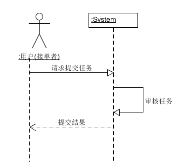
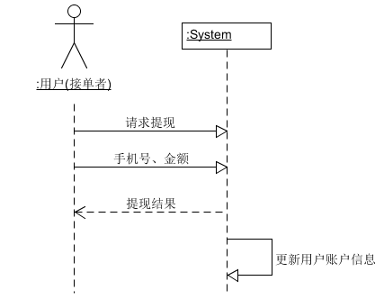

# 功能模型

[详细用例](../Requirement/Usecase_Diagram.md)

## 功能模块

- 登录、注册、注销
- 发布任务
- 查看任务
- 申请任务
- 提交任务
- 放弃任务
- 审核任务
- 充值
- 提现
- 投诉

## 系统顺序图(System Sequence Diagram)

- 登录(16341018 ezlaor)

- 注册(16341018 ezlaor)

- 发布任务(15331035 Chenxr1997)

- 申请任务(16340007 Scott-Cai)

+ 提交任务(16340210wangdchao)

  

  

- 查看任务(16340210 wangdchao)

- 放弃任务(16341018 ezlaor)

- 充值(16340211 wanggh8)

- 提现(16340211 wanggh8)

- 投诉(16340209 tang16340209)

+ 注销（16340210wangdchao）

  

  