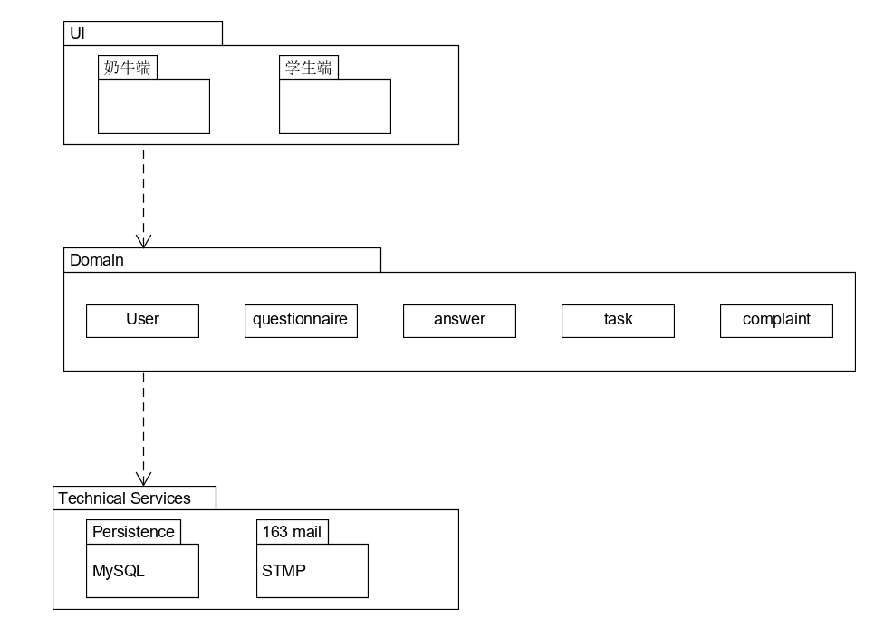
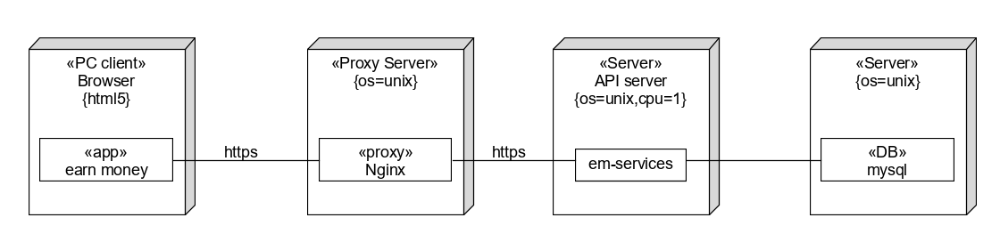

# 软件架构

## 架构问题

### 可靠性和可恢复性

- 因素：访问人数过多导致访问网址过程中出现访问服务端中断问题并进行恢复
- 度量和质量场景：当访问服务端中断时，在正常的工作环境下，如果在15s内检测到其恢复，则重新建立连接
- 该因素对涉众、架构以及其他因素的影响 ：使用者的访问数据可能会发生丢失，无法传递给服务端
- 对于成功的优先级 ：高
- 困难或风险：中等

### 解决方案说明

- 解决方案概要：提高服务器性能
- 因素：限制最大访问数量
- 解决方案：增加服务器内存，限制同时服务的最多用户数，避免服务器负载超荷。优化数据库的查询SQL，避免使用代价高昂的查询，每次查询只返回自己需要的结果；避免短时间内的大量SQL查询，数据库适当建立索引。数据库定期备份，当数据库出现操作失误或系统故障导致数据丢失时可以恢复数据
- 动机：防止资源不足。

## 逻辑视图

## 物理视图

