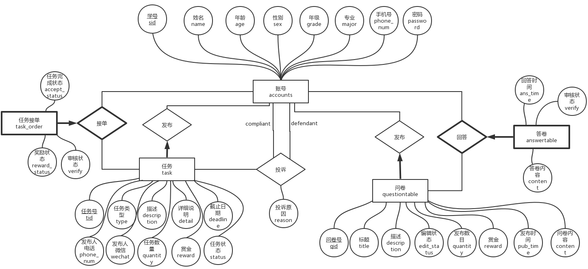

# 数据库设计

## ER模型

## 逻辑模型

- account-账号

    | Field     | Type        | Key  | Description                                                  |
    | --------- | ----------- | ---- | ------------------------------------------------------------ |
| sid       | VARCHAR(8)  | PRI  | 学号，作为主键                                               |
    | name      | VARCHAR(16) |      | 姓名，不能为NULL                                             |
    | age       | INT         |      | 年龄                                                         |
    | sex       | VARCHAR(2)  |      | 性别，只能是’男‘或’女‘                                       |
    | grade     | VARCHAR(4)  |      | 年级，只能是‘大一’，‘大二’，‘大三’，‘大四’，‘研一’，‘研二’，‘研三’，不能为NULL |
    | major     | VARCHAR(40) |      | 专业，不能为NULL                                             |
    | phone_num | VARCHAR(11) |      | 电话号码，在表中必须是唯一的，不能为NULL                     |
    | password  | VARCHAR(20) |      | 密码，不少于6位，不能为NULL                                  |
    | balance   | INT         |      | 账户余额，不能为NULL，默认值为0                              |
    
- questionable-问卷表

    | Field       | Type          | Key  | Description                                                  |
    | ----------- | ------------- | ---- | ------------------------------------------------------------ |
    | qid         | INT           | PRI  | 问卷id号                                                     |
    | sid         | VARCHAR(8)    |      | 问卷发布者学号                                               |
    | title       | VARCHAR(100)  |      | 问卷标题，不能为NULL                                         |
    | description | VARCHAR(200)  |      | 问卷描述，默认为空                                           |
    | edit_status | INT           |      | 编辑状态，0:未编辑完全，1：正在审核或发布中，2：已发布，默认为0 |
    | quantity    | INT           |      | 回收的问卷总数，不能为NULL                                   |
    | reward      | FLOAT         |      | 回答问卷的赏金，不能为NULL                                   |
    | pub_time    | DATETIME      |      | 发布时间，默认值为NULL，当为NULL的时候表示还没有发布         |
    | content     | VARCHAR(5000) |      | 问卷内容，json格式                                           |

- answertable-答卷表

    | Field    | Type          | Key                                            | Description                                                |
    | -------- | ------------- | ---------------------------------------------- | ---------------------------------------------------------- |
    | qid      | INT           | PRI && FOREIGN KEY REFERENCES questionable.qid | 问卷id号                                                   |
    | sid      | VARCHAR(8)    | PRI && FOREIGN KEY REFERENCES accounts.sid     | 问卷填写人学号                                             |
    | ans_time | DATETIME      |                                                | 提交答卷时间，不能为NULL                                   |
    | verify   | INT           |                                                | 审核状态，0表示未审核，1表示审核通过，2表示未通过(默认为0) |
    | content  | VARCHAR(5000) |                                                | 答卷内容，json格式                                         |

- task-任务

    | Field       | Type          | Key                                 | Description                                                  |
    | ----------- | ------------- | ----------------------------------- | ------------------------------------------------------------ |
    | tid         | INT           | PRI                                 | 任务id                                                       |
    | sid         | VARCHAR(8)    | FOREIGN KEY REFERENCES accounts.sid | 任务发布者学号                                               |
    | type        | INT           |                                     | 任务类型，1：问卷任务 2：取快递业务 3：运动业务 4：学习业务 5：求夸业务 6：其他业务 |
    | description | VARCHAR(5000) |                                     | 任务描述                                                     |
    | detail      | VARCHAR(5000) |                                     | 任务详情                                                     |
    | deadline    | DATETIME      |                                     | 截止时间                                                     |
    | phone_num   | VARCHAR(11)   |                                     | 任务发布者手机号                                             |
    | wechat      | VARCHAR(30)   |                                     | 任务发布者微信号                                             |
    | quantity    | INT           |                                     | 任务需求数量                                                 |
    | reward      | FLOAT         |                                     | 任务赏金                                                     |
    | status      | INT           |                                     | 表示任务进行和完成状态                                       |

- task_order-任务接单

    | Field         | Type       | Key                                        | Description                                           |
    | ------------- | ---------- | ------------------------------------------ | ----------------------------------------------------- |
    | tid           | INT        | PRI && FOREIGN KEY REFERENCES task.tid     | 任务id                                                |
    | sid           | VARCHAR(8) | PRI && FOREIGN KEY REFERENCES accounts.sid | 任务接单者学号                                        |
    | accept_status | INT        |                                            | 接单状态，0表示进行中，1表示已完成                    |
    | verify        | INT        |                                            | 审核状态，0表示未审核，1表示审核通过，2表示审核未通过 |
    | reward_status | INT        |                                            | 赏金是否到账，0为没有到账，1为已到账                  |

- comp_order-投诉单

    | Field           | Type          | Key                                 | Description                                           |
    | --------------- | ------------- | ----------------------------------- | ----------------------------------------------------- |
    | cid             | INT           | PRI                                 | 投诉单id                                              |
    | tid             | INT           | FOREIGN KEY REFERENCES task.tid     | 任务id                                                |
    | complainant_sid | VARCHAR(8)    | FOREIGN KEY REFERENCES accounts.sid | 投诉者学号                                            |
    | defendant_sid   | VARCHAR(8)    | FOREIGN KEY REFERENCES accounts.sid | 接单状态，0表示进行中，1表示已完成                    |
    | reason          | VARCHAR(3000) |                                     | 投诉原因                                              |
    | verify          | INT           |                                     | 审核状态，0表示未审核，1表示审核通过，2表示审核未通过 |

- img-投诉单的图片

    | Field    | Type       | Key                                          | Description          |
    | -------- | ---------- | -------------------------------------------- | -------------------- |
    | cid      | INT        | PRI && FOREIGN KEY REFERENCES comp_order.cid | 投诉单id             |
    | img_data | MEDIUMTEXT |                                              | 图片数据(base64格式) |