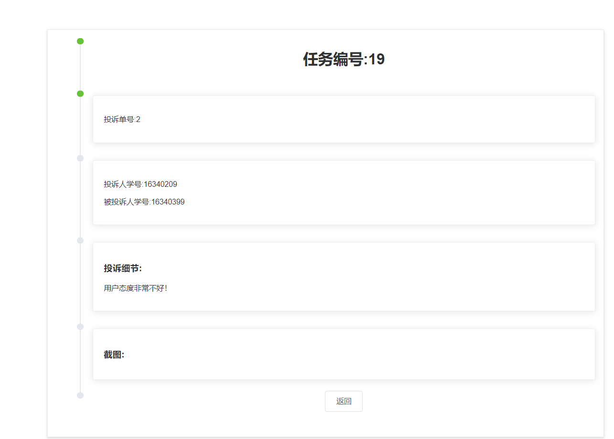

# 原型/UI设计

[传送门](https://www.xiaopiu.com/project?proid=5cc14ff16967a47ec7cab842)

## 原型工具：xiaopiu
 >在线编辑，云保存
 >
 >丰富的组件库和模板
 >
 >简洁的交互式事件设计
 >
 >直接预览参数，方便前端设计
 
## UI设计指南
  
  ### 一致
* 一致性 Consistency
> 与现实生活一致：与现实生活的流程、逻辑保持一致，**遵循用户习惯的语言和概念**；
>
> 在界面中一致：所有的元素和结构需**保持一致**，比如：设计样式、图标和文本、元素的位置等

  ### 反馈
* 反馈 Feedback
>控制反馈：通过界面样式和交互动效让用户可以**清晰的感知自己的操作**；
>
>页面反馈：操作后，通过页面元素的变化清晰地**展现当前状态**。

  ### 效率
* 效率 Efficiency
>简化流程：设计简洁直观的操作流程；
>
>清晰明确：语言表达**清晰**且**表意明确**，让用户快速理解进而作出决策；
>
>帮助用户识别：界面简单直白，让用户快速识别而非回忆，**减少用户记忆负担**。

  ### 可控
* 可控 Controllability
> 用户决策：根据场景可给予用户操作建议或安全提示，但**不能代替用户进行决策**；
>
> 结果可控：用户可以自由的进行操作，包括撤销、回退和终止当前操作等

## 第0轮迭代

**此次迭代主要以方便交互为主要原则,实现首页面及登录、注册页面**

#### 首页

     

#### 登录

     
    
    
    
#### 注册   

## 第1轮迭代
### 工具：xiaopiu

**第1轮开始起步问卷业务，引入奶牛端和学生端与问卷系统的交互界面，页面绘制原则以构图简洁、信息直观为指导原则，要求保证设计风格统一。
如下提出初步UI方案草图，在实际开发过程中根据需求和技术需要继续优化美观。**

#### 整体布局

#### 学生端选择问卷页面

#### 具体问卷页面

#### 奶牛端查所有发布/未发布问卷页面

#### 问卷编辑页面

#### 充值页面

#### 提现页面

#### 个人信息页面

#### 某问卷作答情况查看页面

## 第2轮迭代
### 工具：xiaopiu

**第二轮引入任务逻辑相关的页面，同时加入投诉系统、管理员系统，面对工作量前端组件会较多复用，复用的组件会有些单调并不便于用户区分
 要考虑添加充足的提示信息。**

### 任务/投诉系统
#### 学生端查看可接受任务页面
 

#### “我的任务” 已完成

#### “我的任务”正在进行

#### 奶牛端查看已接收但未提交审核的任务

#### 奶牛端查看已经提交完成的待审核任务

#### 奶牛创建新任务

#### 学生/奶牛投诉相关任务

 

### 管理员系统
 
 #### 主页面

 #### 查看一个投诉单

 #### 查看详细

 

