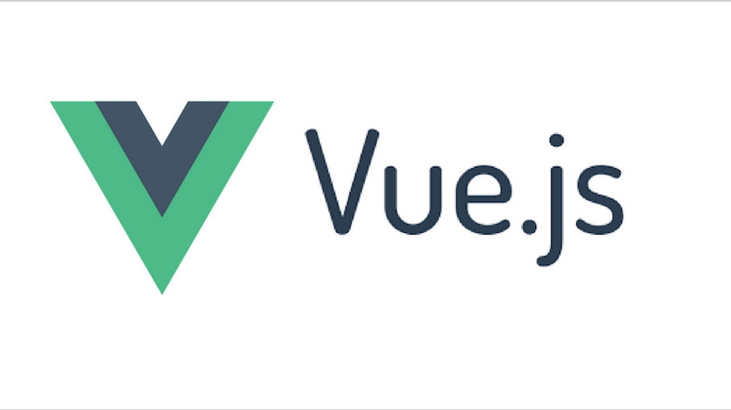
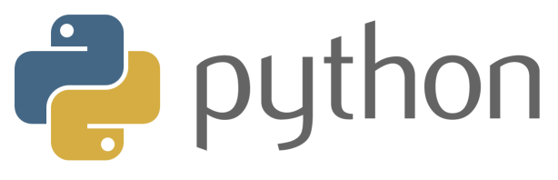
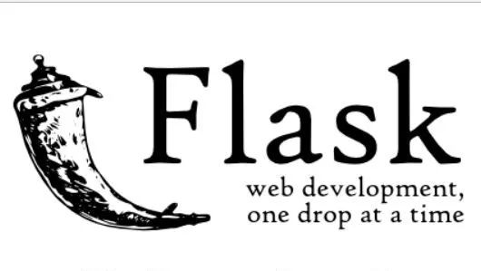

# 技术选型

## 前端技术选型

经过讨论，我们前端框架选用Vue.js

对于我们项目，Vue.js作为前端框架有如下优点：

- Vue.js轻量级框架、简单易学

- Vue.js作为目前非常热门的开发框架，有很多的资料，便于项目人员学习与调试
- Vue.js有很多成熟组件，节省了开发时间，比如很多第三方UI库

## 后端技术选型

我们后端语言使用python

对于我们项目，python作为后端语言有如下优点：

- python入门的学习曲线很友好，容易上手
- 本项目组人员python熟练度较高
- python语言表达能力强，开发周期短
- python有很多的工具包支持开发
- python是解释型语言，部署，测试更加方便

然后我们的后端web框架使用的是flask

对于我们项目，flask作为后端框架有如下优点：

- 相比较于Django，flask是一个轻量级框架、简单易学
- flask扩展性强，有很多第三方组建，方便开发
- Flask比Django更加Pythonic，与Python的开发思想更加吻合