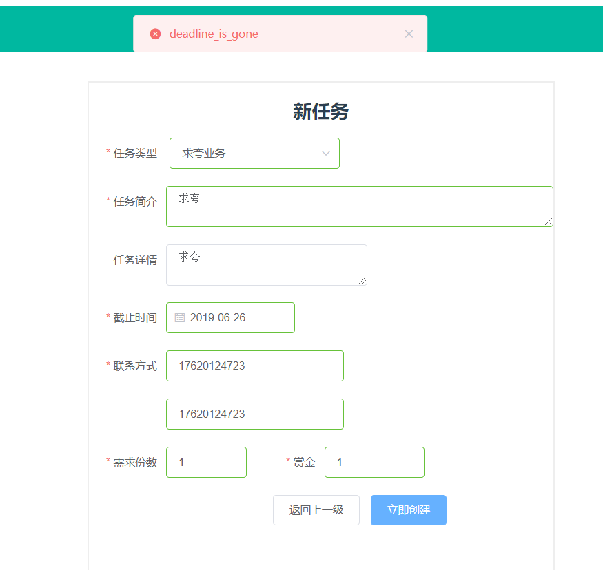
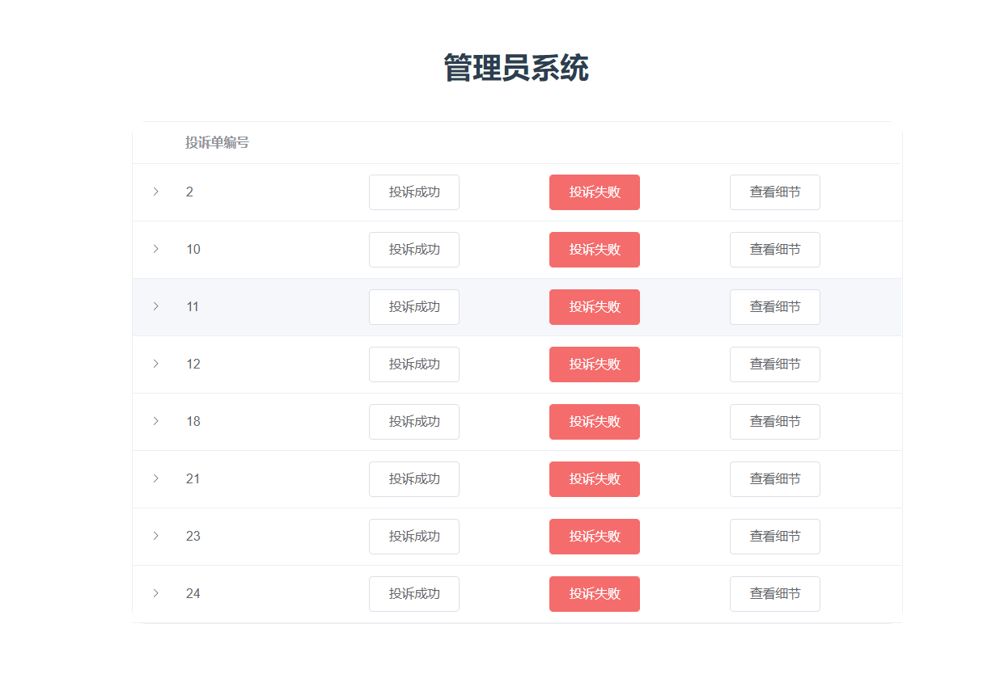

# 成品展示

微云视频链接：https://share.weiyun.com/5EvzxD5 密码：072hjy

[github视频](<https://github.com/sysu-change/Dashboard/blob/master/sysu-change.mp4>)
[腾讯视频](<https://v.qq.com/x/page/s08907dbrz4.html>)
## 登录注册

- 初始界面
  - 对于手机号进行了格式验证
  - 密码进行了密文显示，同时加密处理
  - 滑动块可以根据页面大小变化长度

- 滑动验证块
  - 滑动块验证之前无法点击登录
  - 验证完成后可登录跳转

- 注册页面

  - 学号进行了格式验证，只接受8位数字，且唯一
  - 密码进行两次校验
  - 实现邮箱验证码验证
  - 手机号格式验证，且唯一

  

  ​	

  - 验证码效果

    
  
  - 表单验证功能
  
    

## 主页面

- 兼职任务端

  - 登录后默认跳转页面

  - 设置分页，可以选择每页10个或者5个

  - 默认是问卷任务

    	

  - 其他任务（根据任务类型，显示不同的颜色，同时只获取需求量不为0的任务）
  
  - 拉取任务时使用加载
  
- 奶牛任务端
  
  - 默认问卷任务
  - 进行中的任务
  - 已完成的任务
  
  ## 账户
  
- 个人信息设置
  
  - 可以修改姓名、年龄、年级、专业、性别
  - 修改成功的提示
  
- 充值
  
  - 充值号码进行手机号验证，默认金额为5
  - 成功的消息
  - 失败
  
- 提现
  
  - 验证账户密码
  - 输入支付宝账户手机号
  - 成功
  - 失败
  
- 注销
  
  
## 问卷

-   创建问卷

  - 初始界面
  
  - 选择问题
  
  - 问卷数目为0
  
  - 奖励为0
  
  - 发布成功
  
    
  
- 问卷查看
  
  
  
- 问卷编辑
  
  -   发布后无法编辑
  -   编辑页面
  
- 问卷审核
  
  - 通过后的无法点击
  
  - 可以先查看再审核
  
    
  
-   删除问卷
  
    -   删除44号问卷
      
        

- 填写问卷

  

##   其他任务

- 新建任务
  - 成功
  - 日期已经过去

-   任务详情

  

- 删除任务

  - 删除67号任务

- 任务审核

  
  
- 任务申请

  - 申请任务

  - 跳转到正在进行的任务

    

## 投诉与管理员

- 投诉界面

  - 可以上传一张图片

    

    

    

- 管理员

  - 主页面

  - 查看一个投诉单

  - 查看详细

    
