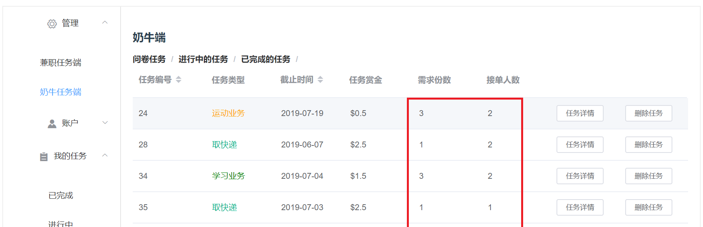
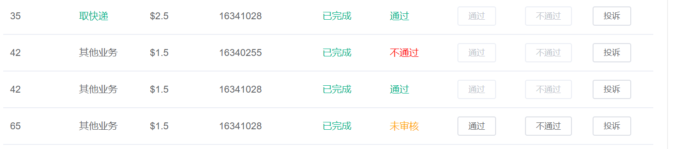

  # <<闲钱宝用户使用手册>>
  
  ## 1.引言
  #### 1.1编写目的
      
  此说明面向所有使用闲钱宝的用户或测试开发者，为使用提供更好体验
      
  #### 1.2[项目背景](about.md)
         
  #### 1.3参考资料
      
  - **软件需求规格说明书**

    README中第3-6项均可囊括在SRS中，其中包括：

    - [Vision(项目愿景)](vision.md)
    - [产品特性库](product_backlog.md)
    - [用例图，业务过程/多泳道图](../Requirement/Usecase_Diagram.md)
    - [用例+活动图](../Requirement/Use_Cases.md)
    - [领域模型](../Requirement/Domain_Model.md)
    - [状态模型](../Requirement/State_Model.md)
    - [功能模型](../Requirement/System_Sequence_Diagram.md)
    - [补充需求](../Requirement/Supplementary_Requirements.md)

- **软件设计文档**

    README中第7项均可囊括在SDS中，其中包括：

    - [技术选型](../design/tech.md)

    - [UI设计](../design/UI.md)
    - [数据库设计](../design/Database.md)
    - [接口API设计](../design/API.md)
    - [架构设计](../design/Architecture.md)
    - [代码文件与逻辑架构映射](../specification/BCE.md)
    - [用例设计](../design/Usecase.md)
    - [部署说明](../specification/deploy.md)
      
## 2. 软件概述
  
  #### 2.1[目标](../project/vision.md)
     
  #### 2.2[功能](../project/product_backlog.md)
  
  #### 2.3 性能
  
   - 数据精确度【项目对输入参数格式和请求顺序有较严格的要求】
   - 时间特性【响应时间、处理时间、数据传输时间不会超过5s】
   - 灵活性【项目与主流浏览器兼容良好】

## 3. 运行环境
  #### 3.1硬件
  
   web项目，无特殊硬件要求,可直接通过IP访问
 
 #### 3.2支持软件
      
   适用多数主流浏览器
  
## 4. 使用说明
  #### 4.1[安装和初始化](../specification/deploy.md)

  #### 4.2用户操作举例
   
  ### 登录
   
   
   
   - 用户进入首页网址即可登录，默认以手机号作为ID，密码为注册时密码
   - 比如：17761202537   wpq163
   
   ### 注册
   
   
   
   - 未注册用户需注册账号，个人信息需完善，注册页面有非法输入验证，邮箱验证码要注意查收。
     
   
   
   ### 关于主页面
   
   
     
 - 用户在页面左侧侧边栏可以选择操作，在右侧主表标签可以选择获取任务或者问卷
 - 学生端主要接受任务和获取问卷以答题，答题可以获取页面上标记的赏金，计入账户
   接受任务时会计入 **我的任务/进行中** ,可在其中查看申请的任务。
   
   
   
   -右侧选中图标可以进入**个人信息页面**，用户可修改信息，查看自己的账户状况
   
   ### 关于发布任务
   
     
   - 用户进入**奶牛任务端**可以编辑问卷或任务，查看**进行中**或**已完成**的任务或问卷
   - 其中问卷情况在单页面上右侧按钮处访问，单击**审核**可以查看答题情况列表
   
   
     
   - 用户可以编辑自己的问卷或任务，任务和问卷下方的**需求**和**单份赏金**请注意：不能使其总和超过余额
   - 编辑操作按页面提示即可
       
   ### 关于我的任务
   
   
    
     
      
    - 用户可以在申请任务后进入**我的任务/进行中**页面查看接单的任务并可以选择完成或放弃该任务
      
     
     
    - 用户可在**我的任务/进行中**页面单击完成任务后进入**我的任务/已完成**查看提交的任务
    - **否**表示还未获得赏金，该任务在奶牛端还未通过
      
      
      
      
      
     - 提交的任务需奶牛在**奶牛任务端/已完成的任务**审核通过后才能获得赏金
     - 用户申请但未完成的任务会在**奶牛**的**奶牛任务端/进行中的任务**
   
   
   ### 关于投诉
     
     
     
      - 用户作为奶牛和学生均可发起投诉，可上传图片证据
      - 投诉单递交给管理员处理审核，审核通过时会通过邮件通知的形式通知投诉人和被投诉人
        
   ### 关于信誉和余额
   
      - 每次答题或 **我的任务/已完成**中的任务得以审核成功时系统会发放赏金
      - 每次遭到投诉会失去**信誉积分**
      - 余额不足将不能发放问卷或任务
      
   
  
  #### 4.2出错和恢复
   
   * 项目中所有正确操作提示信息如下：
     
   
     
     
   * 项目中所有错误操作提示信息如下:
    
  
    
   **如发现类似信息请按提示正确操作**
    
 其他提示信息均为浏览器响应系统消息，此时大多错误来自网络链接不稳定等情况。
    
   
    
      

  #### 4.5求助查询
   
   本项目是web应用，无需用户安装部署，在浏览器打开http://134.175.163.185/font 即用。
   但我们不知道什么时候检查，因此云服务可能会到期，如果发现不能用请联系我们（QQ549241471）+_+

  

 
