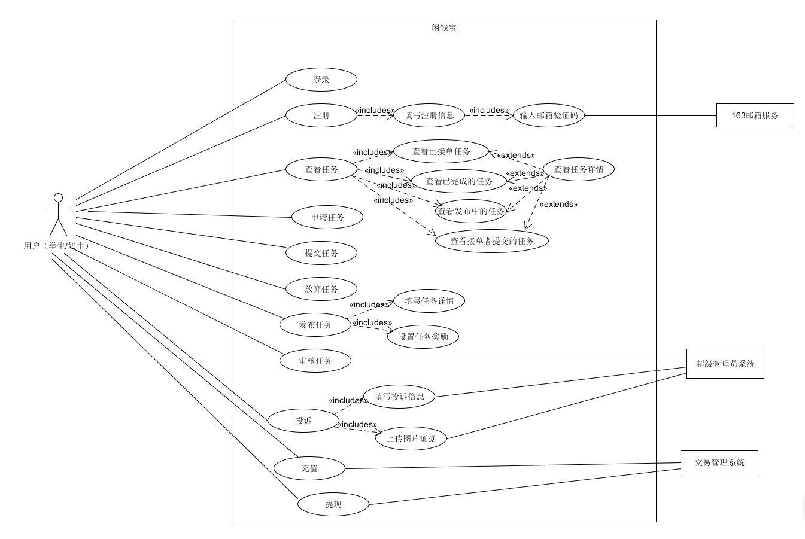

# 架构设计、详细设计（BCE方法）到应用程序框架映射指南

## 1.架构

- 逻辑架构由三层模型（表示层、业务层、持久化层）构成

#### 1.1.表示层 
   * 用户同时可作为接单者和奶牛发布者
   * 使用web作为表示层，提供用户系统、任务管理系统、交易管理系统、账户管理系统、信誉系统和投诉系统

#### 1.2.业务层
  * 服务器充当业务层的角色，为表示层的各个子系统提供相应的服务模块，解释用户的输入并依照用户的输入调用服务

#### 1.3.持久化层
  * Mysql数据库提供了数据的持久化服务

## 2.框架目录设计与逻辑架构

- **框架目录设计：**框架目录是为了服务开发人员，而非限制开发人员。 框架本身并不关注业务，至少不受业务影响或制约。框架就是要从具体的业务功能中，分离出能覆盖所有业务的设计、实现与组成，并使得各业务功能从开发实现的角度，变得解耦合、可重组、易维护。 不同的架构方法论，会将架构分为不同视图，每个视图侧重某一个方面、领域的问题
- **逻辑架构：**其关注的是功能，包含用户直接可见的功能，还有系统中隐含的功能。或者更加通俗来描述，逻辑架构更偏向我们日常所理解的“分层”，由四层模型（表示层、业务层、服务层、持久化层）构成

## 3.BCE方法

- **Boundary 对象**：表示参与者与系统之间进行的交互以及信息交流 ，包括 UI、外部系统接口。用来隔离系统内外，通常负责接收并响应系统内外消息，参与者与系统对象进行消息传递要通过边界
- **Controller 对象**：处理外部事件，实现控制流的类，具有控制行为。通常是一个子系统、一个用例一个类，Boundary发生的用户事件消息，皆是controller的方法，一个用例生成一个控制类。用来控制用例执行期间的复杂运算或者业务逻辑
- **Entity 对象**：表示数据库中存储的信息及相关行为，领域对象或数据实体。系统内部的对象，从领域模型获取属性，如果模型之间存在关联，请将关系转为合适的实现，将controller消息转化为方法

**3.1应用BCE模式规则：**

* 2.1.1针对每一个用例，可以对应生成一个控制类
* 2.1.2参与者对象只能跟边界对象互动
* 2.1.3实体对象不能发送消息给边界对象和控制对象。
* 2.1.4如果只是单纯对数据表进行增加、删除、修改、查询的话，可以不设置控制对象，
让边界对象直接发送消息给实体对象，以提高整个序列图的执行速度。

#### 识别用例可以得到如下关系
边界类（Boundary Class）
 * 用户界面
 * 服务端 Nginx

控制类（Control Class）
 * 用户管理控制类
 * 任务管理控制类
 * 账户管理控制类
 * 交易管理控制类
 * 投诉、信誉管理控制类

 实体类（Entity Class）
  * 用户数据
  * 任务数据
  * 充值数据
  * 投诉数据

### 项目用例简图

 

**2.2用例时序图**


​     
**2.3用例类图**

## 4.框架映射

### 前端目录结构
前端总体上采用基于vue路由跳转的单页网页应用
```
├─ fontend
| ├─ build
| ├─ config //以上是webpack前段打包文件夹
| ├─ node_modules //前端vue框架引入的第三方库、组建、模板
| ├─ src
| | ├─ assests //存放前端所需要的图片等静态文件
| | ├─ components
| | | ├─ Auth
| | | | ├─ AccessAcount.vue //用户详细信息组件界面
| | | | ├─ Register.vue //用户注册组件界面
| | | | ├─ Signin.vue //用户登录组件界面
| | | | ├─ Signout.vue //用户登出组件
| | | | └─ verify.vue //滑动验证码组件
| | | ├─ Ques
| | | | ├─ Check.vue //发布者查看问卷内容组件界面
| | | | ├─ Create.vue //问卷创建组件界面
| | | | ├─ Dajuan.vue //答卷具体内容界面
| | | | ├─ Dajuanlist.vue //答卷列表界面
| | | | ├─ Edit.vue //问卷编辑界面
| | | | └─ Fillin.vue //问卷答题界面
| | | ├─ Set
| | | | ├─ Getjob.vue //获取问卷列表
| | | | └─ Putjob.vue //发布问卷界面
| | | ├─ User
| | | | ├─ Complain.vue //用户投诉界面
| | | | ├─ Recharge.vue //用户充值界面
| | | | └─ Withdraw.vue //用户提现界面
| | | ├─ Task
| | | | ├─ CreateTask.vue //创建其他任务界面
| | | | ├─ DoneTask.vue //用户发布且已完成任务列表界面
| | | | ├─ GetTask.vue //用户获取其他任务列表界面
| | | | ├─ myDoneTask.vue //个人用户已完成的任务列表界面
| | | | ├─ myTodoTask.vue //个人申请的单还未完成的列表界面
| | | | ├─ TaskDetail.vue //任务详情界面
| | | | └─ TodoTask.vue //用户发布的单还未庸人完成任务
| | | ├─ User.vue //用户登录进去后的主界面
| | | └─ Hello.vue //欢迎界面
| | ├─ router
| | | └─ index.js //vue路由文件
| | ├─ storage //sessionstorage管理文件
| | ├─ App.vue //vue的app主主组件，相当于组件树的根组件
| | └─ main.js //引入必要的模块并将app.vue 组件应用到index.html中
| ├─ static //静态文件库（暂时未用）
| ├─ .postcssrc.js
| ├─ index.html //vue前端项目入口文件
| └─ package.json //vue依赖文件，用于指明所需下载的依赖和前端打包

```

### 后端目录结构

```
├─ api
│  ├─ account
│  │  ├─ __init__.py
│  │  ├─ account_function.py
│  │  └─ utils.py
│  ├─ questionnaire
│  │  ├─ __init__.py
│  │  ├─ ans_function.py
│  │  ├─ que_function.py
│  │  └─ utils.py
│  ├─ task
│  │  ├─ __init__.py
│  │  ├─ task_function.py
│  │  └─ utils.py
│  ├─ utils
│  │  ├─ __init__.py
│  │  ├─ assist.py
│  │  ├─ match.py
│  │  └─ utils.py
│  └─ __init__.py
├─ dbTools
│  ├─ __init__.py
│  ├─ dbConfig.py
│  └─ dbTools.py
└─ app.py

```

### 与BCE映射关系

BCE中：

- Boundary：与用户的接口，如：界面、网关、代理等
- Controller：连接 Boundary 和 Entity 的媒介，编排来自 Boundary 的命令的执行
- Entity：代表系统数据，如：账号，问卷，任务，投诉单等

在本系统中，Boundary包含：

- Web 程序用户界面

Controller 包含：

- 服务器框架目录设计中，`app.py` 文件定义了和boundary交互的api逻辑交互的接口，
- 服务器框架目录设计中，`api` 目录下定义了所有相关内容，接受上树app.py解释的命令，封装可能在控制器中的所有业务逻辑。这样，控制器就在那里转发和控制执行。

Entity 包含：

- 服务器框架目录设计中，`api` 目录下定义了与数据库中相关的实体，承载系统数据


