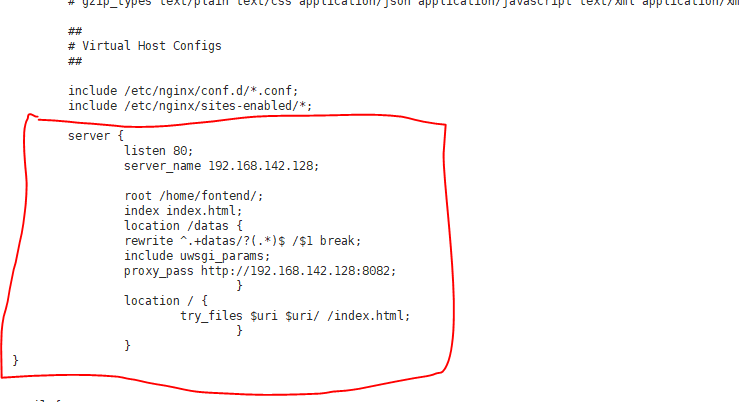

# 部署说明

## 前端部署

部署要素：

+ 基于vue-cli的前端架构
+ nginx代理服务器
+ 阿里云服务器Ubuntu 16.04
+ Xshell

#### 前端代码打包

> npm run build

 **修改文件组件资源引用路径**

修改前端文件夹**config**中的**index.js**文件，由于部署到云服务器上后程序引用资源的路径与本地运行时的差异，需要将index.js的资源引用改为相对路径，即如下图：


将原本的‘/’改为‘./’即可（注意：文件中有两处，都要改）。如果不改，部署到服务器上时会出向空白页。

路径修改完成后便可以在命令行中执行命令**npm run build**指令打包前端文件。执行完成后在项目目录中会生成新的/dist文件夹，里面包含了**index.html**和**/static目录**。此时将这两个文件发到远程的云服务器上即可。

#### nginx代理服务器的搭建

直接将打包后的文件放到远程云服务虚拟机上，其它浏览器是无法直接访问的。需要借助nginx等代理服务器来实现外部浏览器对前端入口文件的**index.html**。以下是在操作系统文Ubuntu 16.04的远程云服务器上搭建nginx的过程：

##### 远程服务器连接Xshell

Xshell可以帮助我们连接远程的云服务器，使得我们同过命令行实现在云服务器上的环境配置，连接过程如下：

下载xshell后，打开，点击新建连接，


弹出如下：


**名称**随便写，**主机**输入云服务器的公网ip地址，其它保持默认。之后点击左边列表**用户身份验证**，如下图：


验证方法采用password，密码验证。输入云服务器的用户名和登录密码，如果登录成功会显示如下欢迎语句：


此时你变可以输入相应的命令行语句，告诉远程服务器执行什么操作。

##### nginx安装

确保上一步能够成功连接到远程服务器的基础上。在Xshell中输入以下指令让远程服务器执行。

> sudo apt-get update

> sudo apt-get install nginx

如果提示需要管理员权限，输入：sudo su进入root模式即可。

以上无误的话，nginx便安装好了，你可以输入nginx -v来查看所安装的nginx版本。如果相似nginx命令不识别，则表明nginx安装失败。

##### nginx配置

关键在于配置nginx.conf文件。

该文件文娱/etc/nginx/文件夹下，直接输入：

> vim /etc/nginx/nginx.conf

便可以用vim编辑器打开该文件。在文件中写入：



其中：

+ **listen**是服务器监听的端口，也是外部浏览器访问服务器时的默认端口，

+ **server_name**：是你服务器的公网ip地址，**root**是绝对路径，指明前端代码inde.html和/static放的根目录（**注意，这里的根目录意思是指nginx服务器的内容服务目录，与nginx有关的文件、网页文件、图片等都应放在这个目录下或这个目录的子目录下**）。
+ **location**用于配置跨域问题，其中的proxy_pass指明对相应的请求都转移到proxy_poss对应的url下。
+ 对于vue项目，若使用了vue-router，需要添加图中的最后一个location，try_files。

**对于前后端分离的vue项目**，需要设置一个新的location来指明对于后端的请求应该放到哪儿，如：

```
location /api {
    rewrite ^/api/(.*)$ /$1 break;
    proxy_pass http://localhost:9090;
}
```

以上代码指明了对于后端的请求应该放到localhost:9090,这表示后端运行在服务器的9090端口。

编辑完成后，可以保存关闭。

vim编辑器的使用方式参照：[vim使用](https://www.runoob.com/linux/linux-vim.html)

##### 启动nginx服务

完成后，输入：

> service nginx start

启动nginx服务，启动完后最好再输入一遍nginx -s reload,重启nginx服务，此时如果之前编辑的nginx.conf文件有错，会报错，以此加以修改。

如果，没啥报错，去浏览器输入云服务器的ip地址便可以访问了前端页面。（注意：如果index.html和/static没有放到nginx服务器的根目录下，而是放到了根目录下的一个子目录下，在浏览器中除了输入云服务器ip地址外，还需要将子目录输入）。

#### 部署结果

经过以上步骤后，在服务器输入：

http://134.175.163.185/font 即可看到项目前端。 

[跳转](http://134.175.163.185/font)   


## 后端部署

## 一、部署架构图


## 二、部署流程

#### 1.1 服务器系统环境

- 腾讯云 Ubuntu 16.04 LTS Server

#### 1.2 Docker 安装

 ubuntu 安装参考如下链接：

- [官方参考链接](https://docs.docker.com/install/linux/docker-ce/ubuntu/#prerequisites)
- [中文参考链接](https://yeasy.gitbooks.io/docker_practice/content/install/ubuntu.html)

windows安装参考如下链接：(win10仅支持win10 pro)

- [Windows Docker 安装](http://www.runoob.com/docker/windows-docker-install.html)

#### 1.3 构建自定义的 Python Flask 应用镜像

为了Docker化一个 Python Flask 应用镜像，我们将要构建我们自己的Docker镜像，这意味要创建一个Dockerfile。

在绝大多数的虚拟机环境中，假如你想要创建一个机器的镜像，你需要首先创建一个虚拟机，然后安装好操作系统，然后安装好应用程序，最后将其转化成一个模板或者镜像。然而，对于Docker来说，这些步骤都可以通过 Dockerfile 进行自动化。一个 Dockerfile 是一个可以向 Docker 提供构建指令的方式。我们将要创建一个可以用来部署一个最简单的 Flask 应用镜像的 Dockerfile 。

##### 项目内容和结构如下：

```sh
.
├── api # 项目App API源码目录
│   ├── account # 用户相关api
│   │   ├── account_function.py
│   │   ├── utils.py # 辅助函数
│   ├── questionnaire # 问卷相关api
│   │   ├── ans_function.py
│   │   ├── que_function.py
│   │   ├── utils.py # 辅助函数
│   ├── task # 其他任务相关api
│   │   ├── task_function.py
│   │   ├── utils.py # 辅助函数
│   ├── utils # 全局辅助函数
│   │   ├── assist.py
│   │   ├── match.py
│   │   ├── utils.py
├── dbTools # db
├── Dockerfile # Docker文件
├── README.md 
├── app.py # app入口
├── requirements.txt # 相关依赖
├── setup.md
```

##### app.py里面主函数设置：

```python
# 测试docker后端部署
@app.route('/')
def test_docker():
    return 'Hi!Welcome to our earn_money app!'


if __name__ == '__main__':
    CORS(app, supports_credentials=True)
    app.run(host='0.0.0.0', port=8082, debug=True)
```

##### requirements.txt:

```
flask>=0.10
Werkzeug>=0.9
DBUtils
PyMySQL==0.8.1
redis
flask-cors
flask_login
```

##### 编写Dockerfile

- **用 `From` 来继承一个 Docker 镜像**

Dockerfile 的第一条指令是FROM指令。这用来将一个已经存在的 Docker 镜像指定为基础镜像。这基本上为我们提供了继承另一个Docker镜像的方法。除了FROM指令之外，还包含了一个MAINTAINER指令，其是用来显示 Dockerfile 的作者的。然后，使用 `ENV LANG C` 来解决后面安装 python3 时出现的 locale 问题。

```
FROM python:3.7-alpine
LABEL maintainer="earn_money"
ENV LANG C.UTF-8d
```

- **将当前目录里面的代码文件拷贝到镜像里面，并且安装 Python 依赖**


```
COPY . /app
WORKDIR /app
RUN pip3 install -r requirements.txt
RUN pip3 install flask-cors --upgrade
```

- **设置 `EntryPoint` 去告诉 Docker 在这个 docker container 中运行 `python3` 的命令，执行 `app.py`**

```DcckerFile
ENTRYPOINT ["python3"]
CMD ["app.py"]
```

总的Dockerfile如下：

```
FROM python:3.7-alpine
LABEL maintainer="earn_money"
ENV LANG C.UTF-8d

COPY . /app
WORKDIR /app
RUN pip3 install -r requirements.txt
RUN pip3 install flask-cors --upgrade
ENTRYPOINT ["python3"]
CMD ["app.py"]
```

#### 构建自己的Docker Image

这一步获取官方镜像会很慢，可以用镜像加速器。（很好用，不然你会等到疯掉）

参考链接：[镜像加速器](https://yq.aliyun.com/articles/29941)

```
$ docker build -t earn_money:latest .
```


#### 使用你构建的镜像运行一个 Docker Container

```
docker run -d -p 8080:8082 earn_money
```

`-d`（detach，脱离）标志是用来告诉 Docker 在后台运行容器；另一个标志是 `-p`，这个标志能让用户来将一个端口从主机机器映射到容器中的一个端口。

不加-d 参数结果如下：（测试时试着用了多个端口）


我们使用的 Flask 应用默认暴露了 5000 端口来提供HTTP服务。默认情况下，与Docker容器内部绑定的端口并没有与主机系统绑定。为了让外部的系统访问容器内部暴露的端口，这些端口必须通过使用 `-p` 标志从主机端口映射到容器端口。假如我们想要端口从主机的 8080 端口，映射到容器中的 8082 端口，我们可以通过使用这种语法 `-p 8080:8082`。

从上面的命令中，看起来我们的容器已经启动成功了。我们可以通过运行执行`docker ps` 或者`docker container list`来验证。


在浏览器中访问 [http://localhost:8080](http://localhost:8080/) , 你现在应该能够拿到 Python Flask 服务器返回的信息。


## 三、常见问题解决方法

### 1. Docker 安装失败

可能是因为天朝被墙的原因，强烈建议使用国内源而不是官方源，详情可以见前面 docker 安装的[中文参考链接](https://yeasy.gitbooks.io/docker_practice/content/install/ubuntu.html)。

### 2. Docker 镜像拉取缓慢

使用国内镜像源加速。

[参考链接](https://yeasy.gitbooks.io/docker_practice/content/install/mirror.html)

### 其他不确定错误

请检查系统环境配置是否和本仓库部署环境一致

- python3.7
- Docker version 18.09.6, build 481bc77
- Ubuntu  Xenial 16.04 (LTS)